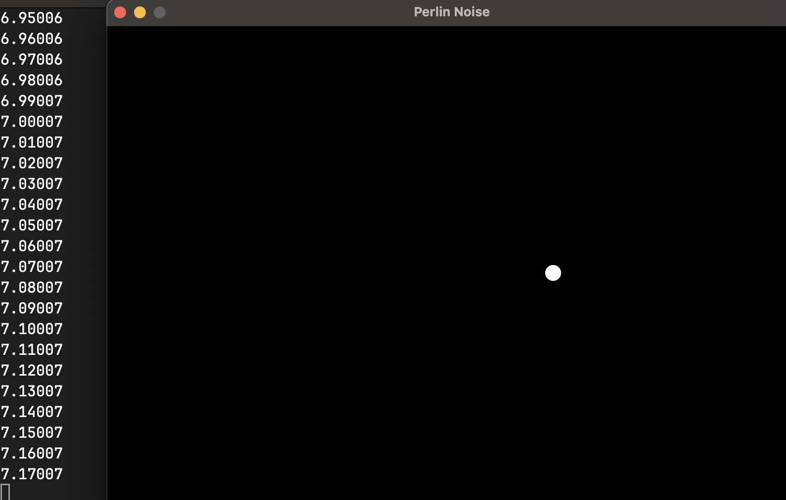

## Overview
- Perlin noise is an algorithm which was developed for procedural computer graphics (textures of wood, stone etc.). In comparission to randomness, the points in noice are calculated within its relation to each other (deterministic & non-linear and not random).
- Perlin noise doesn't count as **bifurcation or chaotic** since small input changes doesn't resolve in a sensetive output. Its just non-linear.
- its calculated over numbers of different octaves of sin waves (fractal qualtiy)

$$
formula: 
\frac{1}{f^n} \rightarrow for occur natural processes 
Noise(x), where x is a vector (in 1,2,3 > dimensions)
$$

$$
Noise(x) = \displaystyle\sum_{i = 0}^N - 1 \frac{Noise(b^ix)}{a^i}
$$

> Screenshot from the simulation

### Resources
[The Nature of Code](https://github.com/nature-of-code/noc-book-2)
[Paul Bourke Blog](https://paulbourke.net/fractals/noise/)
